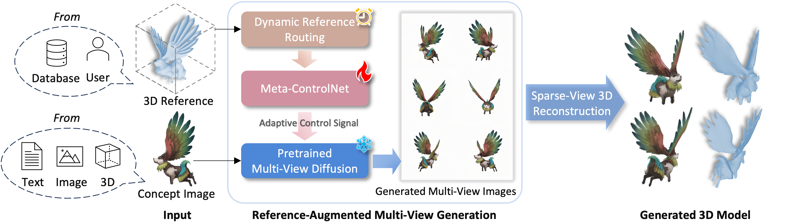

# Phidias: A Generative Model for Creating 3D  Content from Text, Image, and 3D Conditions with Reference-Augmented  Diffusion

## Code will be released soon.

https://github.com/user-attachments/assets/189ffcb2-d777-4d22-829c-c80c3a27a7fe

### [Project page](https://rag-3d.github.io/) |   [Paper]() 

## Abstract
>In 3D modeling, designers often use an existing 3D model as a reference to create new ones. This practice has inspired the development of Phidias, a novel generative model that uses diffusion for reference-augmented 3D generation. Given an image, our method leverages a retrieved or user-provided 3D reference model to guide the generation process, thereby enhancing the generation quality, generalization ability, and controllability. Our model integrates three key components: 1) meta-ControlNet that dynamically modulates the conditioning strength, 2) dynamic reference routing that mitigates misalignment between the input image and 3D reference, and 3) self-reference augmentations that enable self-supervised training with a progressive curriculum. Collectively, these designs result in a clear improvement over existing methods. Phidias establishes a unified framework for 3D generation using text, image, and 3D conditions with versatile applications.

## Overview

    

