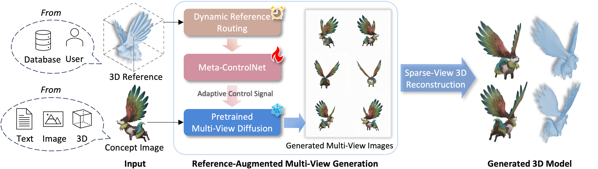

# [ICLR 2025] Phidias: A Generative Model for Creating 3D  Content from Text, Image, and 3D Conditions with Reference-Augmented  Diffusion

## NEWS: 
- [March. 2025] Inference code released! :rocket: :rocket: :rocket:
- [Feb. 2025] Phidias has been accepted to ICLR 2025! :fire: :fire: :fire:

https://github.com/user-attachments/assets/189ffcb2-d777-4d22-829c-c80c3a27a7fe


### [Project page](https://rag-3d.github.io/) |   [Paper](https://arxiv.org/abs/2409.11406)  | [Video](https://www.bilibili.com/video/BV11xtLeEERS/)

<!-- <br> -->
[Zhenwei Wang](https://zhenwwang.github.io/), [Tengfei Wang](https://tengfei-wang.github.io/), [Zexin He](https://github.com/ZexinHe), [Gerhard Hancke](https://rfidblog.org.uk/), [Ziwei Liu](https://liuziwei7.github.io/) and [Rynson W.H. Lau](https://www.cs.cityu.edu.hk/~rynson/).
<!-- <br> -->

## Abstract
>In 3D modeling, designers often use an existing 3D model as a reference to create new ones. This practice has inspired the development of Phidias, a novel generative model that uses diffusion for reference-augmented 3D generation. Given an image, our method leverages a retrieved or user-provided 3D reference model to guide the generation process, thereby enhancing the generation quality, generalization ability, and controllability. Our model integrates three key components: 1) meta-ControlNet that dynamically modulates the conditioning strength, 2) dynamic reference routing that mitigates misalignment between the input image and 3D reference, and 3) self-reference augmentations that enable self-supervised training with a progressive curriculum. Collectively, these designs result in a clear improvement over existing methods. Phidias establishes a unified framework for 3D generation using text, image, and 3D conditions with versatile applications.

## Overview
<div class="half">
    
</div>

## Todo (Latest update: 2025/03/03)
- [x] Release model weights, inference code, rendering code and usage instructions. The inference code has been tested on both RTX4090 (24G) and A100.
- [ ] Release gradio and huggingface demo
- [ ] Release training code and instructions


## Installation
- Environment Setup:
```bash
    conda create -n phidias python==3.10
    conda activate phidias
    # install PyTorch and xFormers
    # xformers is required! please refer to https://github.com/facebookresearch/xformers for details.
    # for example, we use torch 2.1.0 + cuda 11.8
    pip install torch==2.1.0 torchvision==0.16.0 torchaudio==2.1.0 xformers --index-url https://download.pytorch.org/whl/cu118
  

    # a modified gaussian splatting (+ depth, alpha rendering)
    git clone --recursive https://github.com/ashawkey/diff-gaussian-rasterization
    pip install ./diff-gaussian-rasterization

    # for mesh extraction
    pip install git+https://github.com/NVlabs/nvdiffrast

    # other dependencies
    pip install -r requirements.txt
```
- If you want to render reference maps by yourself, please install [Blender3.2.2](https://download.blender.org/release/Blender3.2/)
```
wget https://download.blender.org/release/Blender3.2/blender-3.2.2-linux-x64.tar.xz && \
  tar -xf blender-3.2.2-linux-x64.tar.xz && \
  rm blender-3.2.2-linux-x64.tar.xz
  ```

- Download our pretrained models and precomputed point-cloud features from [huggingface](https://huggingface.co/ZhenweiWang/Phidias-Diffusion/tree/main), and place them under `model/`
```bash
  mkdir model
  huggingface-cli download ZhenweiWang/Phidias-Diffusion --local-dir model/
```

## Inference
```bash
  # Exaples 1:
  # without 3D reference (vanilla zero123++ with white background)
  python infer.py big --workspace results/no_ref --mv_controlnet_path None --rembg --test_path data_test/image_to_3d/chair_watermelon.png

  # Exaples 2:
  # user-specified 3D reference (3D-to-3D), using pre-rendered reference maps
  python infer.py big --workspace results/3d_to_3d --rembg --test_path data_test/3d_to_3d --no-use_retrieval

  # Exaples 3:
  # retrieve 3D reference from objaverse subset and perform online rendering
  python infer.py big --workspace results/image_to_3d --rembg --test_path data_test/image_to_3d --use_retrieval --top_k_retrieval 1 2 3 --online_rendering --blender_path blender-3.2.2-linux-x64/blender  --render_azimuth 0 --render_elevation 0
```
#### Tips:
- Use `--online_rendering` to render retrieved 3D object during inference, which is more convenient but would make inference slower. Note that the results would be insatisfactory due to mis-aligned view angles between concept image and rendered CCMs. Please check the visualization (xxx_mv_refs_64.png) under `results/` and adjust `--render_azimuth` and `--render_elevation` to align the angles manually for better results. 
- Online rendered reference maps are saved to `data_test/ref_maps_retrieved`.
- To reduce rendering cost during inference, you could also set `--no-online_rendering` and prepare all reference maps by pre-rendering all objaverse objects listed in `data_train/objaverse/meta.json` under `--root_dirs`. 
- Use `--rembg` to remove the background of your image automatically. Remember to adjust `--resize_fg_ratio` so that the object has the same size with reference maps. 
- We support retrieve reference with top-1 to top-5 similarities. You could set `--top_k_retrieval 1 2 3` to get results using top-1, top-2 and top-3 3D references.
- Adjust `--seed` to find best results. Default: 42.
- Use `--controlnet_conditioning_scale` to adjust the control strength manually. Default: 1.0.
- The default results are in the format of 3D gaussians. You could convert them into meshes as in LGM by running `python convert.py big --test_path results/saved.ply`, but the quality is limited.

## Data rendering
- We provide the full Objaverse uids that we used in our paper under `data_train/objaverse`.
- We also provide a code example for rendering images for training and testing, including rgba, normal and ccm. See `scripts/blender_script.py`.

## Citation
If you find this work helpful for your research, please cite:
```
@article{wang2024phidias,
        title={Phidias: A Generative Model for Creating 3D  Content from Text, Image, and 3D Conditions with Reference-Augmented  Diffusion}, 
        author={Zhenwei Wang and Tengfei Wang and Zexin He and Gerhard Hancke and Ziwei Liu and Rynson W.H. Lau},
        eprint={2409.11406},
        archivePrefix={arXiv},
        primaryClass={cs.CV},
        year={2024},
        url={https://arxiv.org/abs/2409.11406},
  }
```
